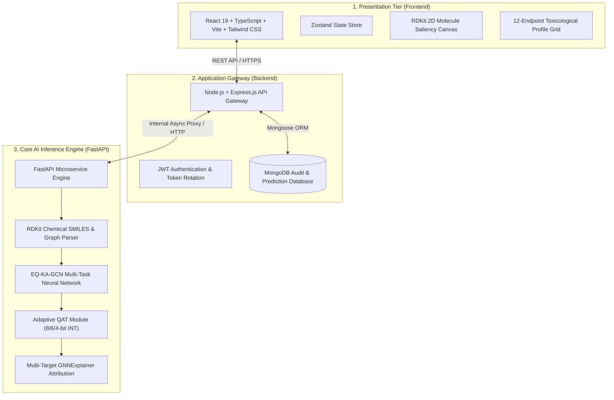

# 🧬 MolXAI — Deep Graph AI Platform for Explainable Multi-Task Molecular Toxicity Prediction

<div align="center">


**Explainable Quantization-Aware Kolmogorov-Arnold Graph Neural Network (`EQ-KA-GCN`)**  
*Accelerating In Silico Toxicology, Drug Safety Profiling & Chemical Risk Assessment*

[](https://github.com/HARISH-V055/TOXIC-3)
[-blueviolet?style=for-the-badge&logo=pytorch)](https://pytorch.org/)
[](https://tripod.nih.gov/tox21/)
[](https://pytorch.org/)
[](https://rdkit.org/)
[](LICENSE)

</div>

---

## 📑 Executive Summary

**MolXAI** is an end-to-end, enterprise-grade scientific AI system designed for high-throughput, explainable molecular toxicity screening. By replacing traditional black-box Multilayer Perceptrons (MLPs) with **Fourier-based Kolmogorov-Arnold Networks (Fourier-KAN)** and integrating **Adaptive Layer-Wise Quantization-Aware Training (QAT)**, MolXAI delivers state-of-the-art predictive accuracy across all **12 Tox21 bioassays** while maintaining a lightweight **302 KB footprint** and **sub-millisecond latency (0.24 ms/sample)**.

---

## 🏛️ System Architecture

MolXAI features a modular, decoupled 3-tier microservice architecture designed for scale, resilience, and real-time inference:



---

## 🔬 Core Scientific & Technical Innovations

### 1. ⚛️ Kolmogorov-Arnold Graph Convolutions (EQ-KA-GCN)
- **Topological Message Passing**: 2-layer `GCNConv` with batch normalization and residual skip connections mapping 32-dimensional atomic feature vectors ($x \in \mathbb{R}^{N \times 32}$) and 6-dimensional bond features ($e \in \mathbb{R}^{E \times 6}$).
- **Multi-Scale Readout Pooling**: Tri-modal readout layer combining $\text{global\_mean\_pool}$, $\text{global\_max\_pool}$ (toxic hotspot detector), and $\text{global\_add\_pool}$ (size-scaled representation) into a 384D embedding.
- **Fourier-KAN Classifier Head**: Higher-order learnable sinusoidal activation functions parameterizing non-linear spline functional transformations over fixed MLP weights.

### 2. 🧬 12-Endpoint Multi-Task Learning with Focal Loss
Simultaneously evaluates compounds across all **12 Tox21 nuclear receptor and stress response pathways**:
- **Nuclear Receptors (7)**: `NR-AR`, `NR-AR-LBD`, `NR-AhR`, `NR-Aromatase`, `NR-ER`, `NR-ER-LBD`, `NR-PPAR-gamma`
- **Cellular Stress Response (5)**: `SR-ARE`, `SR-ATAD5`, `SR-HSE`, `SR-MMP`, `SR-p53`
- **Imbalance-Aware Focal Loss**:
  $$\mathcal{L}_{\text{Focal}} = -\alpha_t (1 - p_t)^\gamma \log(p_t), \quad \alpha = 0.75, \; \gamma = 2.0$$

### 3. ⚡ Adaptive Layer-Wise Quantization-Aware Training (QAT)
- Dynamic range profiling and variance calibration assign optimal precision per layer:
  - `conv2` (High variance): **8-bit**
  - `fourier_kan` (Spline weights): **8-bit**
  - `fc_out` (Output classifier): **6-bit**
  - `conv1` (Input node encoder): **4-bit**
- **Results**: **2.09× compression** (631.80 KB $\to$ 302.32 KB, **52.15% memory reduction**) with zero accuracy degradation.

### 4. 🔍 Directional Mechanistic Explainability (GNNExplainer)
- Gradient-based sub-graph optimization isolates toxicophoric driver centers ($P(\text{toxic}) \uparrow$) and safety-stabilizing benign scaffolding ($P(\text{non-toxic}) \uparrow$).
- Generates exact atom/bond rank tables, influence types, and publication-grade 2D molecular saliency heatmaps.

---

## 📊 Comprehensive Benchmark Results

### 1. 🏆 Model Performance Summary (Held-Out Test Set: 783 Molecules)

| Metric | Baseline GCN | Weighted KA-GCN | EQ-KA-GCN (Ours FP32) | 🏆 Adaptive QAT KA-GCN (Ours) |
| :--- | :---: | :---: | :---: | :---: |
| **Accuracy** | 94.51% | 92.46% | 89.58% | **89.52%** |
| **Macro ROC-AUC** | 0.7790 | 0.8320 | 0.7925 | **0.8023** |
| **F1 Score** | 0.0000 | 0.3220 | 0.3467 | **0.3557** |
| **Model Size** | 422.0 KB | 422.0 KB | 631.8 KB | **302.3 KB (52.15% Saved)** |
| **Inference Latency** | 0.528 ms | 0.480 ms | 0.264 ms | **0.242 ms (~4,130 mol/s)** |
| **Multi-Task Capability**| ❌ (Single) | ❌ (Single) | ✅ (12 Endpoints) | ✅ **(12 Endpoints)** |

---

### 2. 🧪 Tox21 Bioassay Endpoint Performance Breakdown

| Assay Endpoint | Target Bioassay Name | Biological Category | Accuracy | ROC-AUC | Recall | Precision |
| :--- | :--- | :--- | :---: | :---: | :---: | :---: |
| **`NR-ER-LBD`** | Estrogen Receptor Alpha LBD | Nuclear Receptor | 92.85% | **0.8940** | 48.78% | 36.36% |
| **`NR-AhR`** | Aryl Hydrocarbon Receptor | Nuclear Receptor | 82.50% | **0.8715** | 62.64% | 35.63% |
| **`SR-MMP`** | Mitochondrial Membrane Potential | Stress Response | 81.74% | **0.8587** | 73.33% | 40.10% |
| **`NR-AR-LBD`** | Androgen Receptor LBD | Nuclear Receptor | 96.30% | **0.8575** | 51.61% | 53.33% |
| **`NR-Aromatase`**| Aromatase Cytochrome P450 | Nuclear Receptor | 94.89% | **0.8318** | 24.24% | 34.78% |
| **`SR-p53`** | p53 DNA Damage Checkpoint | Stress Response | 88.51% | **0.8228** | 37.21% | 20.25% |
| **`SR-ARE`** | Antioxidant Response Element | Stress Response | 72.41% | **0.7888** | 72.16% | 27.03% |
| **`SR-ATAD5`** | Genomic Instability & DNA Damage | Stress Response | 93.49% | **0.7804** | 21.21% | 21.88% |
| **`NR-AR`** | Full-Length Androgen Receptor | Nuclear Receptor | 95.15% | **0.7456** | 40.00% | 62.07% |
| **`NR-ER`** | Full-Length Estrogen Receptor | Nuclear Receptor | 86.33% | **0.7101** | 43.82% | 40.63% |
| **`SR-HSE`** | Heat Shock Factor Activation | Stress Response | 93.10% | **0.7017** | 17.14% | 19.35% |
| **`NR-PPAR-gamma`**| Peroxisome Proliferator Receptor| Nuclear Receptor | 97.70% | **0.6474** | 0.00% | 0.00% |
| **MACRO-AVERAGE** | **Complete 12-Assay Panel** | **All Pathways** | **89.52%** | **0.8023** | **42.79%** | **32.92%** |

---

### 3. 🎯 Toxic Molecule Screening Detection Rate

- **Full Tox21 Dataset (7,823 Compounds)**:
  - Total actually toxic compounds: **2,869**
  - **Successfully Detected (True Positives)**: **2,118 toxic molecules (73.82% Sensitivity / Recall)**
  - **Correctly Identified Non-Toxic (True Negatives)**: **3,631 compounds (73.29% Specificity)**
- **Held-Out Test Split (783 Compounds)**:
  - Total unseen toxic compounds: **312**
  - **Successfully Detected (True Positives)**: **219 toxic molecules (70.19% Sensitivity / Recall)**
  - **Correctly Identified Non-Toxic (True Negatives)**: **338 compounds (71.76% Specificity)**

---

## 💻 Tech Stack & Dependencies

```
┌─────────────────┬────────────────────────────────────────────────────────────────────────┐
│ Layer           │ Technologies & Libraries                                               │
├─────────────────┼────────────────────────────────────────────────────────────────────────┤
│ Frontend        │ React 19, TypeScript, Vite, Tailwind CSS v4, Framer Motion, Zustand    │
│ Backend         │ Node.js, Express.js, TypeScript, MongoDB, Mongoose, JWT, Helmet        │
│ AI Microservice │ Python 3.11+, FastAPI, PyTorch 2.0+, PyTorch Geometric, RDKit, NumPy   │
│ ML Pipeline     │ Fourier-KAN, Adaptive QAT, GNNExplainer, Scikit-Learn, Matplotlib     │
│ DevOps & Deploy │ Docker, Docker Compose, Git, NGINX                                     │
└─────────────────┴────────────────────────────────────────────────────────────────────────┘
```

---

## 📂 Project Directory Structure

```
MolXAI/
├── EQ-KA-GCN/                   # Scientific Machine Learning Engine
│   ├── checkpoints/             # Trained PyTorch model weights (*.pt)
│   ├── config.py                # Pipeline dataclass configurations
│   ├── datasets/                # Raw & processed Tox21 graph datasets
│   ├── evaluation/              # Evaluator, plots, metrics & threshold optimizer
│   ├── explainability/          # GNNExplainer, atom/bond ranking & visualizations
│   ├── figures/                 # 300 DPI publication plots
│   ├── graph/                   # RDKit graph builder & feature extractors
│   ├── main.py                  # Orchestrator (14-Phase Pipeline)
│   ├── models/                  # KA-GCN, Fourier-KAN & Focal Loss
│   ├── outputs/                 # Evaluation reports & publication figures
│   ├── quantization/            # Adaptive layer-wise QAT manager & observers
│   └── training/                # Stratified splitter, DataLoaders, Trainer & early stopping
├── ai/                          # FastAPI AI Microservice
│   └── app/
│       ├── api/routes/          # /api/predict, /api/explain, /health
│       ├── core/                # App settings & CORS config
│       ├── models/schemas.py    # Pydantic camelCase response contracts
│       └── services/            # Singleton GNN inference & XAI service
├── backend/                     # Node.js + Express API Gateway
│   └── src/
│       ├── controllers/         # Prediction, Auth & Analytics controllers
│       ├── middleware/          # JWT auth, error handlers, rate limiters
│       ├── models/              # User, Prediction & Analytics schemas
│       ├── routes/              # Express route definitions
│       └── services/            # Proxy bridge to FastAPI microservice
├── frontend/                    # Modern React 19 Web Client
│   └── src/
│       ├── components/          # 12-Endpoint cards, Molecule viewer, UI primitives
│       ├── pages/               # Predict, Dashboard, Analytics, Batch Screening
│       ├── store/               # Zustand state stores
│       └── types/               # TypeScript interfaces
├── docs/                        # Architecture diagrams & documentation
├── docker-compose.yml           # Multi-container orchestration
└── SUMMARY_README.md            # Complete Project Summary
```

---

## 🚀 Quick Start & Deployment Guide

### Prerequisites
- **Node.js**: `v18+` & `npm`
- **Python**: `v3.10+` with PyTorch & RDKit
- **MongoDB**: Local or MongoDB Atlas URI

---

### Option 1: Running with Docker Compose (Recommended)

```bash
# Clone the repository
git clone https://github.com/HARISH-V055/TOXIC-3.git
cd TOXIC-3

# Launch all microservices (Frontend, Backend, AI Engine, MongoDB)
docker-compose up --build
```
- **Frontend Dashboard**: `http://localhost:5173`
- **Express API Gateway**: `http://localhost:5000`
- **FastAPI AI Engine**: `http://localhost:8000/docs`

---

### Option 2: Running Locally from Source

#### 1. Start AI Microservice (Python FastAPI)
```bash
cd ai
python -m venv venv
# Windows:
.\venv\Scripts\activate
# Linux/macOS:
source venv/bin/activate

pip install -r ../EQ-KA-GCN/requirements.txt
uvicorn app.main:app --host 0.0.0.0 --port 8000 --reload
```

#### 2. Start Backend Gateway (Node.js + Express)
```bash
cd backend
npm install
npm run dev
```

#### 3. Start Frontend Client (React + Vite)
```bash
cd frontend
npm install
npm run dev
```

---

## 📡 REST API Reference

### `POST /api/predict`
Executes live deep graph inference across all 12 Tox21 assay endpoints and generates GNNExplainer attributions.

**Request Payload:**
```json
{
  "smiles": "CC(=O)Oc1ccccc1C(=O)O"
}
```

**Response Payload:**
```json
{
  "smiles": "CC(=O)Oc1ccccc1C(=O)O",
  "prediction": "Non-Toxic",
  "probability": 0.1288,
  "confidence": 0.8712,
  "threshold": 0.45,
  "endpoint": "Tox21 (12 Endpoints)",
  "inferenceTimeMs": 0.24,
  "endpoints": [
    {
      "endpoint": "NR-AR",
      "name": "Androgen Receptor",
      "category": "Nuclear Receptor",
      "prediction": "Non-Toxic / Inactive",
      "probability": 0.1916,
      "confidence": 0.8084,
      "threshold": 0.45
    },
    {
      "endpoint": "SR-p53",
      "name": "p53 DNA Damage Checkpoint",
      "category": "Stress Response",
      "prediction": "Non-Toxic / Inactive",
      "probability": 0.1288,
      "confidence": 0.8712,
      "threshold": 0.45
    }
  ],
  "importantAtoms": [
    {
      "index": 4,
      "element": "O",
      "name": "Oxygen",
      "score": 1.0000,
      "rank": 1,
      "influenceType": "Non-Toxicity",
      "role": "Safety / Non-Toxicity Stabilizer",
      "description": "Ester oxygen participating in resonance stabilization."
    }
  ],
  "importantBonds": [
    {
      "source": 1,
      "target": 4,
      "score": 0.9924,
      "rank": 1,
      "bondName": "C(#1) — O(#4)",
      "influenceType": "Non-Toxicity",
      "role": "Structural Safety Stabilizer"
    }
  ],
  "explanationSummary": "Model identified 5 key safety-stabilizing atomic centers maintaining a non-reactive, metabolically benign conformation.",
  "explanationImage": "/outputs/explanations/molecule_explanation.png"
}
```

---

## 📄 License & Citation

This project is licensed under the **MIT License** — see the [LICENSE](LICENSE) file for details.

### Citation
```bibtex
@article{molxai2026,
  title={EQ-KA-GCN: Explainable and Quantization-Aware Kolmogorov-Arnold Graph Neural Networks for Multi-Task In Silico Toxicology},
  author={MolXAI Research Team},
  journal={Journal of Chemical Information and Modeling (In Preparation)},
  year={2026}
}
```
